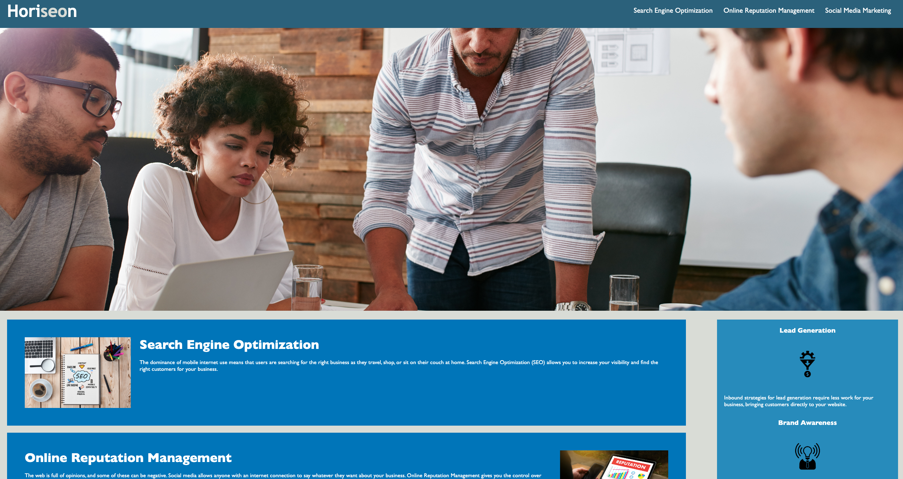

# Code Refactor Starter Code

## Description
This repo is for the UCLA fullstack program bootcamp, module 1.  
This assignment was to refactory code to make it more efficent and to demonstrate an understanding of best practices of HTML and CSS.  
The module 1 assignment procided the following as a guideline and criteria for the assignment:

### User Story
AS A marketing agency  
I WANT a codebase that follows accessibility standards  
SO THAT our own site is optimized for search engines 

### Acceptance Criteria
GIVEN a webpage meets accessibility standards 
WHEN I view the source code 
THEN I find semantic HTML elements 
WHEN I view the structure of the HTML elements 
THEN I find that the elements follow a logical structure independent of styling and positioning  
WHEN I view the image elements 
THEN I find accessible alt attributes 
WHEN I view the heading attributes 
THEN they fall in sequential order 
WHEN I view the title element 
THEN I find a concise, descriptive title 

### Changes Made
1) Fixed page title
2) HTML Optimized - Divs replaced with semantic HTML elements, as well as formatting/spacing changes to be more in line with HTML best practices. 
3) Inserted ALT text for images to bring the webpage in line with disability standards.
4) Altered CSS and respective HTML classes to prevent excess code -- an elimination of reduncies.

### Links
Original Repo: https://github.com/coding-boot-camp/urban-octo-telegram  
Deployed Application: https://vulnusr.github.io/CSLockwood-M1-CodeRefactory/

### Screenshot

### Contact

Github: VulnusR
Gmail: Caleb.lockwood626@gmail.com, Vulnus.Regium@gmail.com
